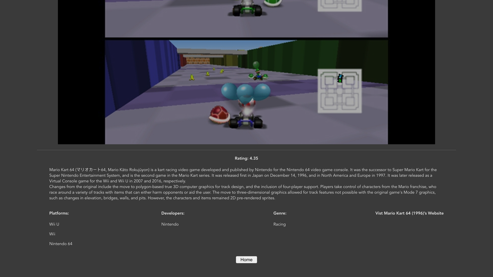

# Video Game DB

## Date: 01/27/2022
### By: Benjamin Peck
#### [GitHub](https://github.com/benjaminobambino) | [LinkedIn](https://www.linkedin.com/in/benjaminlpeck/)
***
### ***Description***
#### "Video Game DB" is a frontend Vue app where visitors may find a variety of video games either by genre or by a name search. This app was built using Vue.js and multiple API calls to the RAWG API. While I built a similar app using React, this version has some definite improvements to navigation, game details, and overall functionality.

***
### ***Technologies Used***
* Vue
* Axios
* 3rd Party API
* JavaScript
* CSS3
  * Flex
* HTML5
***
### ***Getting Started***
#### The project has been deployed on Vercel and can be viewed at [vue-rawg.vercel.app](https://vue-rawg.vercel.app/).
#### Once launched, browse video games by genre or search for a game by its name.
***
### ***Screenshots***
#### Browse by Genre

#### Search

#### Game Details

***
### ***Future Updates***
- [ ] Move API calls into backend
- [ ] Add app title to header
- [ ] Add pagination for more games
- [ ] Add subreddit posts to game details
- [ ] Add platform components
***
### ***Credits***
<li>
  <a
    href="https://www.linkedin.com/in/benjaminlpeck/"
    target="_blank"
    rel="noopener noreferrer"
  >
    Benjamin Peck:
  </a>
  app creator
</li>
<li>
  <a
    href="https://www.andrepato.com/"
    target="_blank"
    rel="noopener noreferrer"
  >
    Andre Pato
  </a>
  and
  <a
    href="https://michaellackey.com/"
    target="_blank"
    rel="noopener noreferrer"
  >
    Michael Lackey:
  </a>
  prompt and starter code
</li>
<li>
  <a
    href="https://rawg.io/apidocs"
    target="_blank"
    rel="noopener noreferrer"
  >
    RAWG:
  </a>
  Video Games Database API used for game genres, images, titles,
  ratings, and other details
</li>
<li>
  <a
    href="https://pluspng.com/png-54686.html"
    target="_blank"
    rel="noopener noreferrer"
  >
    PlusPNG:
  </a>
  App favicon
</li>